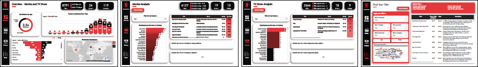
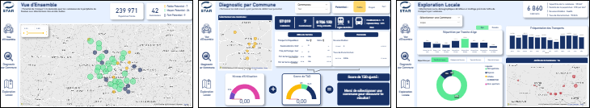

---

#### 🕵️‍♀️ Quelques mots pour me présenter :

<strong>Data Analyst</strong> spécialisé en <strong>Business Intelligence</strong> et en <strong>transformation de données</strong>, j’aide les organisations à structurer, fiabiliser et valoriser leurs indicateurs afin d’optimiser leur <strong>pilotage opérationnel et stratégique</strong>.    
Fort d’une expérience significative au sein d’<strong>environnements techniques exigeants</strong>, j’ai développé une expertise complète en <strong>data processing</strong>, <strong>modélisation</strong>, <strong>visualisation</strong> et <strong>automatisation des reportings</strong>. Après plusieurs années en ingénierie des systèmes et infrastructures, j’ai pris la <strong>responsabilité du pôle Data</strong>, où j’ai conçu et industrialisé des <strong>dashboards stratégiques</strong> pour le suivi de <strong>projets majeurs</strong>, tout en accompagnant les équipes métiers dans l’interprétation de leurs <strong>KPI</strong>.   
Je mets en place des processus structurants autour de la <strong>qualité des données</strong>, de la <strong>standardisation</strong> et de la <strong>gouvernance de la donnée</strong>, en collaboration avec des équipes <strong>pluridisciplinaires</strong>.  
Mon objectif : fournir une vision <strong>claire, fiable et actionnable</strong>, et instaurer une <strong>culture data</strong> commune.

  

---

 

#### 🎓 Certifications Data :

[-000000?style=flat&logo=redhatopenshift&logoColor=white&labelColor=5600FF)](https://www.credential.net/73b5e1a6-0ff0-4482-b547-3be27efa0235#acc.VLbydjvK)
[-000000?style=flat&logo=redhatopenshift&logoColor=white&labelColor=5600FF)](https://www.credential.net/493c7d46-8191-4b73-9294-f6d962de489b#acc.Olxjq4SQ)

 

#### 🎯 Expertises :
### Power BI
- Power Query (ETL, nettoyage, transformation)
- Modélisation de données (schéma en étoile)
- Optimisation des modèles et des performances
- DAX avancé (mesures, time intelligence)
- Sécurité (RLS)
- Publication & partage (Service Power BI)

### Excel
- Power Query (nettoyage, transformation, automatisation des données) & Power Pivot
- Analyse de données & modélisation
- Tableaux de bord & reporting automatisé
- Tableaux croisés dynamiques avancés
- Fonctions avancées (RECHERCHEX, SI, LET, LAMBDA)
- VBA & Office Script
- Intégration IA

### SQL
- Nettoyage, transformation et validation des données
- Modélisation et interrogation de bases relationnelles
- Agrégations avancées & optimisation des requêtes
- Requêtes complexes (JOIN, sous-requêtes, CTE)
- Fonctions analytiques (WINDOW functions)

 

#### 💼 Compétences Professionnelles :

##### 📊 Data Visualization :

##### 💻 Langages de Programation :

##### 🗄️ Data Plateforms :

##### 🧠 Machine Learning :

##### ☁️ Cloud :

##### 🛠️ Outils :

 

---

### 
 🔎 Réalisations 

### Power BI :

#### 📌 Tableau de Bord - Netflix

- **Contexte métier :** Plateforme de streaming cherchant à comprendre et optimiser son catalogue
- **Objectif :** Transformer les données en insights actionnables pour guider des décisions
- **Données :** Dataset Kaggle Netflix (cadre éducatif)
- **Stack :** Power BI

#### 📌 Tableau de Bord - Mobilités Rennaise

- **Contexte métier :** Aide à la décision pour le déploiement du transport à la demande en périphérie de Rennes, en réponse aux limites du transport collectif classique en zones peu denses
- **Objectif :** Identifier et prioriser les communes à potentiel TAD en croisant données socio-démographiques, offre de transport et usages, via des indicateurs et scores directement exploitables par les équipes métiers
- **Données :** Réseau TàD STAR, INSEE, Datagouv
- **Stack :** Python, PostgreSQL, Power BI
  
 

<!--
### Excel :
-->
